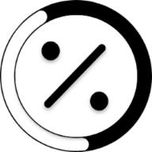

<div align="center">



# Scrolled

[](https://addons.mozilla.org/en-US/firefox/addon/scrolled/)
[](https://ko-fi.com/eucaue)

</div>

**Scrolled** is a lightweight Firefox extension that adds a subtle scroll indicator to show how much of a page you've read. Perfect for readers, researchers, or anyone who wants better visual feedback while browsing long content.

---

## ✨ Features

- 📊 Clean and elegant scroll progress bar
- 🧠 Automatically works on any webpage
- ⚡ Fast and lightweight
- 🧩 No setup required – just install and go

---

## 📦 Installation

### 🦊 Install from Firefox Add-ons Store (Recommended)

You can install Scrolled directly from the official Mozilla Add-ons store:

➡️ [Install Scrolled on Firefox](https://addons.mozilla.org/en-US/firefox/addon/scrolled/)

---

### 🧑‍💻 Manual Installation (Development)

> Requires [Node.js](https://nodejs.org) and [npm](https://www.npmjs.com)

1. Clone the repository:

```bash
git clone https://github.com/EuCaue/scrolled.git
cd scrolled
```

2. Install dependencies:

```bash
npm install
```

3. Build the extension:

```bash
npm run build:prod
```

This will generate a `.zip` file in the root directory, ready for installation in Firefox.

4. Load it in Firefox manually:
   - Go to `about:debugging`
   - Click **"This Firefox"** → **"Load Temporary Add-on..."**
   - Select the `manifest.json` file inside the `dist` folder

---

## 🛠️ Tech Stack

- TypeScript
- WebExtension APIs
- TailwindCSS
- Rollup
- PostCSS

---

## 🚀 Todo

- [x] Customizable scroll bar colors
- [x] Enable/disable per site
- [ ] Dark mode compatibility

---

## 📃 License

GPLv3 © [EuCaue](https://github.com/EuCaue)
